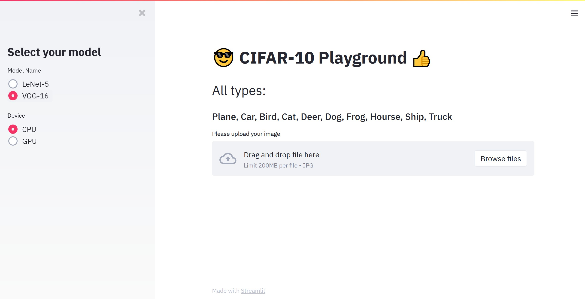

# CIFAR_10-with-pytorch

## 1 简介

一个Pytorch练习，实现CIFAR-10数据集的图像分类，目前暂时实现了LeNet-5和VGG-16模型。VGG-16的测试准确率可以达到84%，程序运行状态如下所示：
```text
PS D:\Files\Github\CIFAR_10-with-pytorch> python .\main.py --do_eval --vgg
Start checking path...
Check path done.
Files already downloaded and verified
Files already downloaded and verified
Testing...
Test Iteration: 100%|█████████████| 2500/2500 [01:44<00:00, 24.02it/s]
10000张测试集中的准确率为: 84 %
```
前端页面效果如下：


## 2 项目依赖：

* pytorch
* tqdm
* argparse
* streamlit


## 3 项目目录：

受Github上传文件的大小限制，一些体积较大的测试图片及训练好的模型参数文件都没有上传，这里给出的是笔者本地的项目目录结构，可以根据需要自行进行新增或删改

```text
root/
  |_ data/
  |   |_ CIFAR-10 original data.
  |
  |_ model/
  |   |_ Well-trained model prameter files.
  |
  |_ test/
  |   |_ Some test images.
  |
  |_ web/
  |   |_ app.py 
  |
  |_ __init__.py
  |
  |_ dataset.py
  |_ main.py
  |_ model.py
  |_ predict.py
  |_ test.py
  |_ train.py
  |_ unil.py
  |
  |_ README.md
  |_ .gitignore
```

Some Hints:

* data目录用于存放CIFAR-10原始格式的数据
* test目录存放一些用于自测的图片，无硬性要求
* web目录原本的设想是基于Flask和Bootstrap实现一个简单的前端，但受时间限制最后改用了streamlit
* dataset.py文件用于进行CIFAR-10的数据读取工作
* model.py文件实现了两个模型，分别是LeNet-5和VGG-16
* main.py文件里自定了一些命令行参数，根据个人需要进行添加或删除即可  


## 4 训练：

```shell
python ./main.py --do_train [--vgg/--lenet]
```


## 5 测试：

```shell
python ./main.py --do_eval [--vgg/--lenet]
```


## 6 预测：

```shell
python ./main.py --do_predict [--vgg/--lenet]
```


## 7 启动前端页面

```shell
cd web
streamlit run app.py
```